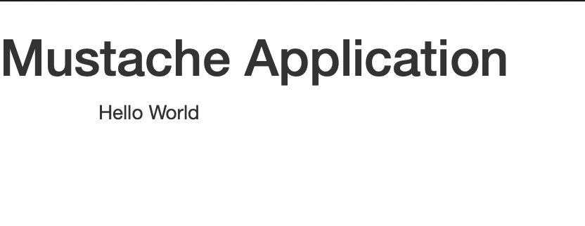

# Spring and {{ Mustache }} 

---
## Prerequisites

- Java: 1.8.0_181
- Spring Boot: 1.4.7.RELEASE

### Spring Dependencies
- Mustache
- Actuator
- Cloud Security
- Test
- DevTools

## Tutorial
### 1. シンプルな Mustache アプリケーション

Mustache テンプレートを用いた静的画面を表示するのみのシンプルなアプリケーションを作ります。

#### 1.1. Controller

まず "/" アクセスした時に `Index` ページを表示する Controller クラスを準備します。

```java
@Controller
class HomeController {
  @GetMapping("/")
  String home() {
    return "index";
  }
}
```

#### 1.2. Index Page

Index ページではシンプルに `Hello World` を表示するのみの単純なアプリケーションとします。

```html
{{>header}}
<h1>Demo</h1>
<div class="container">Hello World</div>
{{>footer}}
```

#### 1.3. Mustache 記法 - Partials

Index ページの中で、次のような記述をしています。

- `{{>header}}`
- `{{>footer}}`

これは、タグの中で示している名前のMustacheファイルの内容に置換する記述の仕方です。
上記の場合は、 別に作成している `header.html` と `footer.html` の記述内容が index.html に取り込まれます。

<details><summary>header.html</summary>

```html
<!doctype html>
<html lang="en">
<head>
    <meta charset="utf-8" />
    <title>Demo Application</title>
    <meta name="description" content="" />
    <meta name="viewport" content="width=device-width" />
    <base href="/" />
    <link rel="stylesheet" type="text/css"
          href="/webjars/bootstrap/css/bootstrap.min.css" />
    <script type="text/javascript" src="/webjars/jquery/jquery.min.js"></script>
    <script type="text/javascript"
            src="/webjars/bootstrap/js/bootstrap.min.js"></script>
</head>
<body>
```
</details>

<details><summary>footer.html</summary>

```html
</body>
</html>
```
</details>

### 2. Model オブジェクトの利用

Model オブジェクトを生成し設定した値を Mustache テンプレートで表示するアプリケーションを作ります。

#### 2.1. Mustache 記法 - Variables

`header.html` と `index.html` で静的に表示設定していた内容を以下のように変更します。

- header.html

```html
<title>{{title}}</title>
```

- index.html

```html
<h1>{{title}}</h1>
```

Model オブジェクトでキー名が `title` として設定された属性の値をそれぞれ表示します。

#### 2.2. Model オブジェクトの設定

Controller クラスの中で Model オブジェクトの設定を行う処理を追加します。

```
@GetMapping
public String home(Model model) {
	model.addAttribute("title", "Mustache Application");
	return "index";
}
```

#### 2.3. spring-boot:run

この時点のアプリケーションを起動します。

```
$ ./mvnw clean spring-boot:run -DkipTests -Dmaven.test.skip=true
```

#### 2.4. 動作確認

Curl 及びブラウザからアクセスして動作確認を行います。

```
$ curl -X GET http://localhost:8080
```

```html
<!doctype html>
<html lang="en">
<head>
    <meta charset="utf-8" />
    <title>Mustache Application</title>
    <meta name="description" content="" />
    <meta name="viewport" content="width=device-width" />
    <base href="/" />
    <link rel="stylesheet" type="text/css"
          href="/webjars/bootstrap/css/bootstrap.min.css" />
    <script type="text/javascript" src="/webjars/jquery/jquery.min.js"></script>
    <script type="text/javascript"
            src="/webjars/bootstrap/js/bootstrap.min.js"></script>
</head>
<body>

<h1>Mustache Application</h1>
<div class="container">Hello World</div>
</body>
</html>
```

